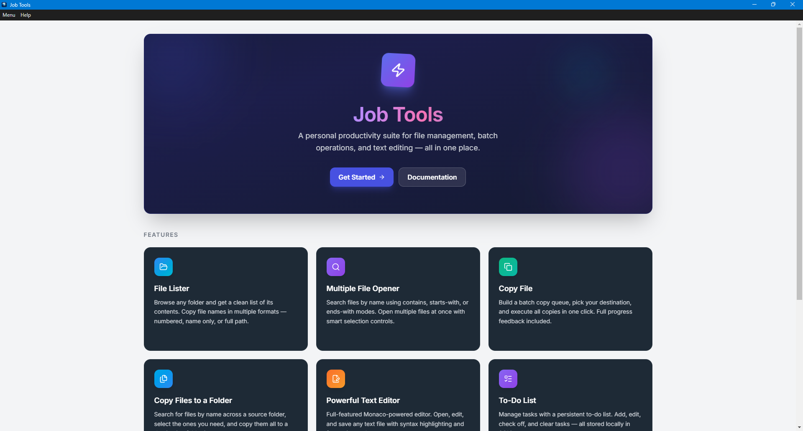
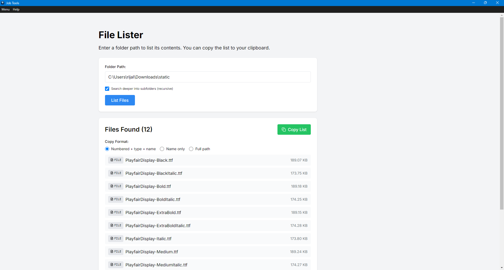
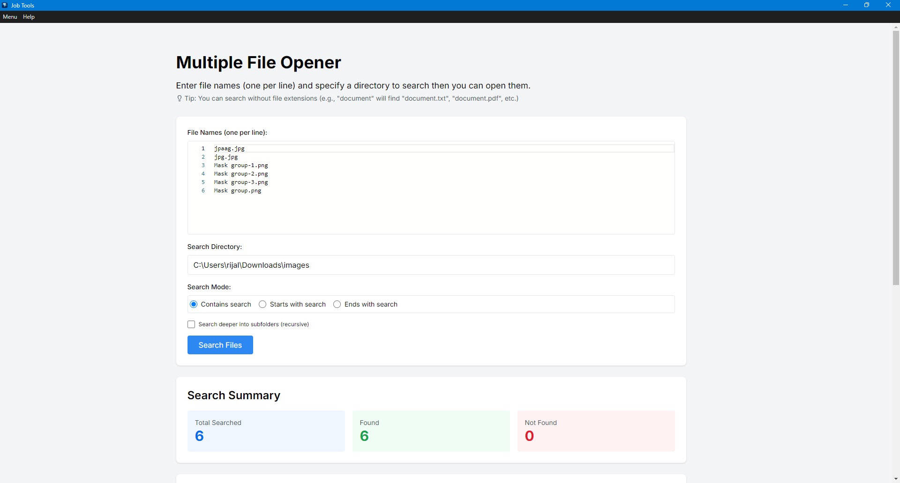
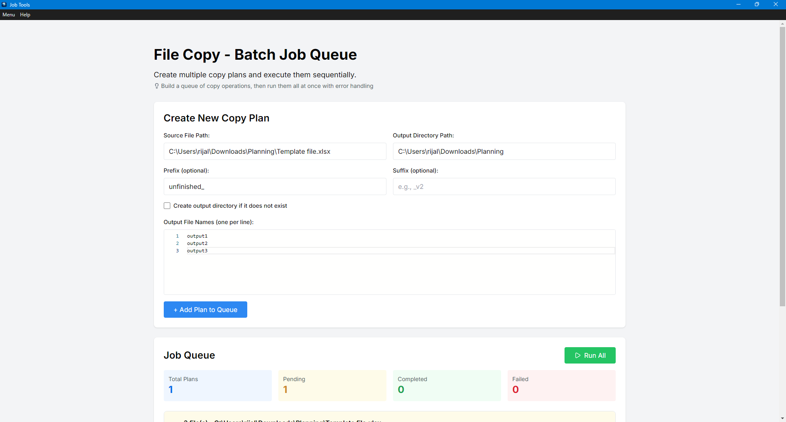
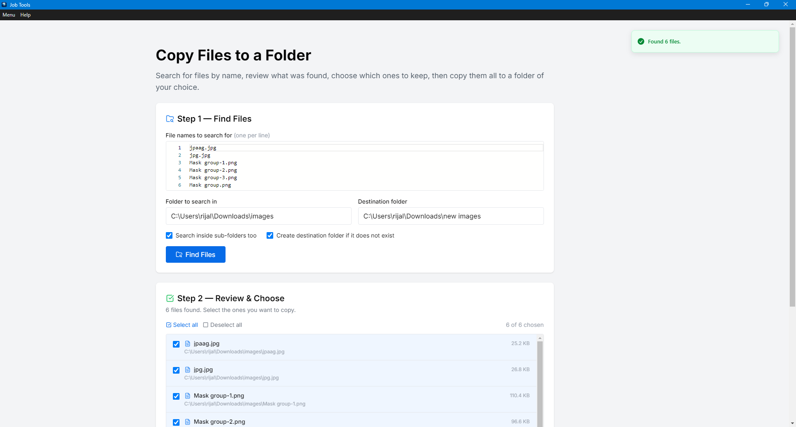
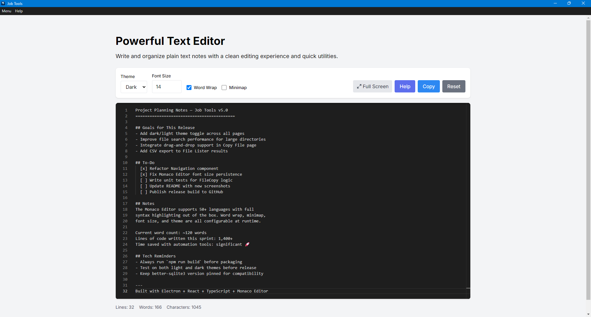
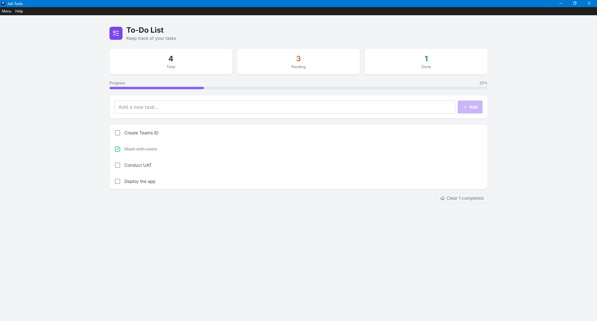
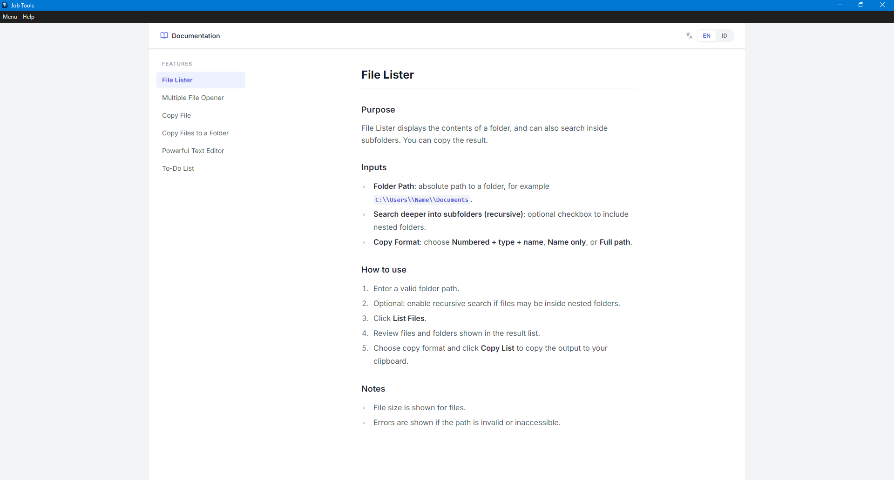

# Job Tools

A desktop productivity app for file management and text editing, built with Electron, React, and TypeScript.



## Features

### File Lister

Browse any folder and get a clean list of its contents. Copy file names in multiple formats — numbered, name only, or full path.



### Multiple File Opener

Search files by name using contains, starts-with, or ends-with modes. Open multiple files at once with smart selection controls.



### Copy File

Build a batch copy queue, pick your destination, and execute all copies in one click. Full progress feedback included.



### Copy Files to a Folder

Search for files by name across a source folder, select the ones you need, and copy them all to a destination folder in one go.



### Powerful Text Editor

Full-featured Monaco-powered editor. Open, edit, and save any text file with syntax highlighting, theme switching, word wrap, and word/character/line counts.



### To-Do List

Persistent task list backed by SQLite. Add, edit, complete, and delete tasks — data survives app restarts.



### Size Label Card Maker

Upload an Excel order summary, review and sort the imported rows, design per-field card layout (font, size, alignment, prefix/suffix), then export print-ready size label cards directly to PDF.

### Carton Catalog

Maintain a named catalog of carton box sizes (W × H × D). Add entries manually or bulk-import from an Excel spreadsheet. Every entry gets an animated 3D preview. Open any carton in the interactive Carton Viewer for sticker placement.

### Carton Viewer

Interactive 3D carton viewer. Place, drag, and resize sticker labels (emoji or custom image) on any face of the box. Uses orbit controls for free rotation and zoom.

### Help

Built-in bilingual help documentation (English / Indonesian).



## Tech Stack

- **Shell**: [Electron](https://www.electronjs.org/) 33
- **Renderer**: [React](https://react.dev/) 18 + [TypeScript](https://www.typescriptlang.org/) 5
- **Build tool**: [Vite](https://vitejs.dev/) 5
- **Styling**: [Tailwind CSS](https://tailwindcss.com/) 3
- **Editor**: [Monaco Editor](https://microsoft.github.io/monaco-editor/) via `@monaco-editor/react`
- **Database**: [better-sqlite3](https://github.com/WiseLibs/better-sqlite3) (local SQLite for To-Do List)
- **Routing**: [React Router DOM](https://reactrouter.com/) 7
- **3D rendering**: [Three.js](https://threejs.org/) + [`@react-three/fiber`](https://docs.pmnd.rs/react-three-fiber) + [`@react-three/drei`](https://github.com/pmndrs/drei)
- **Excel I/O**: [xlsx](https://sheetjs.com/) (SheetJS)
- **Auto-update**: [electron-updater](https://www.electron.build/auto-update)
- **Icons**: [lucide-react](https://lucide.dev/)
- **Notifications**: [Sonner](https://sonner.emilkowal.ski/)
- **Testing**: [Vitest](https://vitest.dev/) + [Playwright](https://playwright.dev/)

## Getting Started

```sh
# Install dependencies
npm install

# Start development server
npm run dev
```

> **Note:** `better-sqlite3` is a native addon. The `postinstall` script runs `electron-rebuild` automatically after `npm install`.

## Scripts

| Command | Description |
|---|---|
| `npm run dev` | Start in development mode with hot reload |
| `npm run build` | Compile TypeScript, bundle with Vite, then package with electron-builder |
| `npm run preview` | Preview the Vite production build |
| `npm test` | Run Vitest unit tests |

## Building for Distribution

```sh
npm run build
```

Outputs are placed in `release/{version}/`. The build produces:

- **Windows**: NSIS installer (`x64`) and portable executable (`x64`)
- **macOS**: DMG and ZIP

## Directory Structure

```
├── electron/
│   ├── main/          # Electron main-process source (IPC handlers, file system, SQLite)
│   └── preload/       # Preload scripts (exposes IPC to renderer)
│
├── src/
│   ├── pages/         # Feature pages (FileList, FileCopy, TextEditor, TodoList, …)
│   ├── components/    # Shared UI components (Navigation)
│   ├── context/       # React context (fullscreen state)
│   └── help/          # Markdown help content (en/, id/)
│
├── public/            # Static assets (icons, images)
├── release/           # Build output — generated by electron-builder
└── test/              # Playwright e2e tests
```

## License

MIT
